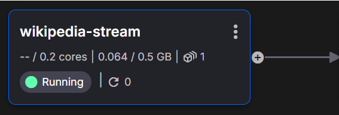
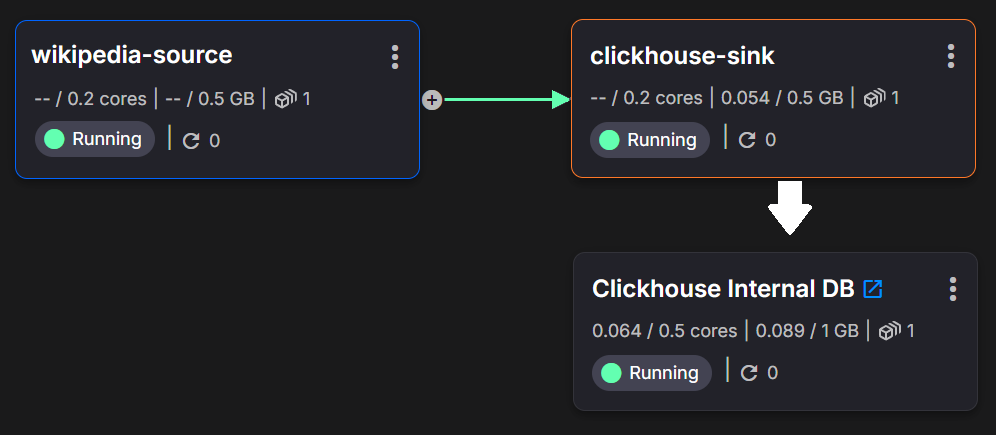

# **Getting Started with Klaus Kode — the Agentic Data Integrator** 

 Klaus Kode is a Python-based Agentic Data Integrator that helps you [vibe code](https://en.wikipedia.org/wiki/Vibe_coding) your data integrations so you can connect to more systems, faster. You run it in your terminal as a workflow wizard. It uses AI agents to generate connector code, run and test that code, analyze logs, as well as managing dependencies and environment variables. It uses the [Quix Cloud](https://quix.io/quix-cloud) platform as a sandbox for running code in isolated containers and storing data. 

Note that Klaus Kode is designed to help build pipelines that need *high throughput*. If you’re dealing with a very small number of events (such as emails and chat messages from a handful of users), you might be better off with [make.com](http://make.com) or [n8n.io](https://n8n.io/). 

Klaus Kode is best suited for scenarios where you need to integrate high-fidelity data sources — this could be continuous telemetry streams, blockchain transaction feeds or large static datasets that need to be ingested and processed in a distributed manner.


## **Prerequisites**

You’ll need a few things already in place before you can start with Klaus Kode. 

These include:

1. Python and Git installed on your system  
2. The Claude Code CLI  
3. A Quix project and PAT token   
4. API tokens and billing enabled for OpenAI GPT APIs and Anthropic Claude APIs   
   *\* If you are a Quix customer and early beta tester you might be able to get these keys from the Quix team*

Klaus Kode has been tested on Ubuntu (via WIndows WSL), and Mac OS. It should work on Windows too but has not been tested on Windows yet.


### **Notes on Installing the Claude Code CLI** 

Klaus Kode leverages the Claude Code SDK under the hood, which in turn uses the Claude Code CLI. If you don't have an Anthropic account yet, [sign up](https://claude.ai/login) first.

According to the [Anthropics official instructions](https://docs.anthropic.com/en/docs/claude-code/setup), you install Claude Code like this:

```shell
npm install -g @anthropic-ai/claude-code
```

However, some of our test users seem to encounter permissions errors with the previous method. 

The following install commands seem to be more reliable:

```shell
(Linux/Mac)            curl -fsSL https://claude.ai/install.sh | bash

(Windows Powershell)   irm https://claude.ai/install.ps1 | iex
```

### **Tokens and API Keys**

Klaus Kode uses OpenAI GPT4o for log file analysis and Anthropic’s Claude Sonnet 4 (via Claude Code). Therefore you need accounts with both services with billing enabled. Quix Cloud is used for deployments and sandbox testing. 

In summary, you need the following keys and tokens: 

1. An [Anthropic API key](https://docs.anthropic.com/en/api/overview) API key — requires an Anthopic account with billing enabled and enough credit to run Claude Code. 

2. An [OpenAI API key](https://platform.openai.com/docs/libraries) API key — if you have verified your organization already, it is cheaper to switch to GPT5-mini. You can do this 

3. A [Quix Cloud PAT token](https://quix.io/docs/develop/authentication/personal-access-token.html) — you can [sign up for free](https://portal.cloud.quix.io/signup?utm_campaign=klaus-kode) to get one (this lets Klaus Kode run the code in a cloud sandbox)  
     
   You should then configure your environment variables with these keys as described in the following section

## **Klaus Kode Setup**

To use Klaus Kode, clone the repo, create and activate a virtual environment, install the dependencies and run the startup script.

Here are those steps again in more detail:

1) Clone the Klaus Kode repo   
   

```shell
$ git clone https://github.com/quixio/quix-coding-agent.git
```

   

2) Set up a virtual environment and activate it (assuming Linux/Mac)  
   

```shell
$ python -m venv venv
$ source venv/bin/activate
```

   

3) Install the Klaus Kode dependencies.  
   

```shell
(venv) $ pip install -r requirements.txt
```

   

4) Create a .env file (make a copy of the.env example) and enter your API keys and PAT token  
   

```py
OPENAI_API_KEY=<your-openai-api-key> # "sk-proj..."
ANTHROPIC_API_KEY=<your-anthropic-api-key> # "sk-ant-api..."
QUIX_TOKEN=<your-quix-token> # "pat-..." 
QUIX_BASE_URL=https://portal-api.cloud.quix.io/

## OPTIONAL: If Klaus cannot autonmatically detect your Claude Code installation
CLAUDE_CLI_PATH=/home/username/.claude/local/node_modules/.bin
```

   

   

5) Run Klaus Kode  
   

```shell
(venv) $ python main.py
```

 


## **Klaus Kode Data Integration Workflow**
You don't have to understand the workflow to get started, you can just give it a go and see what happens. 

However, if you're used to using a free-form chat interface to generate code, it can be helpful to understand what awaits you. 

Klaus Kode is different from most AI-based clients because it uses a cloud evironment  (Quix Cloud) to manage code rather that an local project. This cloud enviroment requires you to follow specific workflows.

When you start Klaus Kode you’ll see the following options:

```

Select Workflow Type
--------------------
  ▶ 1. Source Workflow (Bring data in from another system)
    2. Sink Workflow (Write data out into an external system)
    3. Transform Workflow (Process data in flight) *Coming soon
    4. Debug Workflow (Diagnose and fix existing sandbox code) *Coming soon

```

Hopefully, the wording is straightforward enough to help you choose the right option.

### Example Scenario: Read the Wikipedia Event Stream and Sink to Clickhouse

To understand the workflow better, let's look at an example scenario and break down how you would implement it in Klaus Kode. 

Suppose that I want to do some kind of research on Wikipedia page edits that happen in the coming week. In technical terms,  I want to listen to the Wikipedia Change Event Stream and sink the data to a Clickhouse database so that I can query it offline.

Here’s an outline of how it would work in Klaus Kode:

* First, you start Klaus Kode and choose the “**Source Workflow**” option (since we’re sourcing data from an external data stream)  
    
  * Klaus Kode will help you create a sandbox app for you to get started and will guide you through the process of creating Python code to get data out of the Wikipedia change event stream. This data is written to a “topic”  (a topic is essentially just a giant log file—a place to put the data we get from Wikipedia).

* Once that’s done,  you loop back to the start of the wizard and choose the “**Sink Workflow**”.

  * Klaus Kode will help you create another sandbox app and will guide you through the process of creating Python code to read from the topic you created in the source workflow, and sink that data into a Clickhouse database (with proper backpressure, batching and other dark magic)

This is a very simple example scenario, and we’re purposely not doing much to the data while it’s in flight (such as aggregating or analyzing it). The purpose of this early prototype is to simply show you how you can use AI to get high volumes of data in and out of any system. 

### **The Source Workflow**

When following the sink workflow, you’ll be guided through the following phases:

**1—SOURCE SETUP**<br>
**2—KNOWLEDGE GATHERING**<br>
**3—CODE GENERATION**<br> 
**4—CONNECTION CODE TESTING**<br> 
**5—FIRST DEBUG PHASE (IF CONNECTION CODE FAILS)**<br> 
**6—SCHEMA ANALYSIS**<br>
**5—PRODUCER CODE CREATION**<br>
**6—PRODUCER CODE TESTING**<br> 
**7—SECOND DEBUG PHASE (IF CODE FAILS)**<br> 
**8—DEPLOYMENT**<br> 

---

#### 1—SOURCE SETUP PHASE
Klaus Kode will ask you for some details that are specific to the Quix Cloud environment (it detects your environment based on your PAT token). 

Quic Cloud is where code is run and data is stored.

* Choose an **app name** for the sandbox app. Lets just call it “*wikipedia-source*”  
* Select a **Project**: Just choose the default “MyProject”  
* Select a **Topic**: Just choose the default “input-data” (a topic is essentially just a giant log file, a place to put the data we get from Wikipedia)

---

#### 2—KNOWLEDGE GATHERING PHASE
Next, Klaus Kode will ask you what you want to do, i.e. what your source system is, and what kind of data you want to get from it. The purpose of this phase is to create code that will successfully connect to the source and read some sample data from it, and analyse the shape of the data. We will not write anything to a Kafka topic yet.

* **Enter Requirements**: Lets just say “*I want to read basic page edit metadata from the Wikipedia Change Event Stream”*   
  (you can of course be much more precise about the fields you want to get)

#### 3—CODE GENERATION PHASE

* **Generate Code:** After you submit your requirements, Klaus Kode will invoke the mighty Claude Code CLI which will get to work drafting some code that reads from data from the Wikipedia EventStreams HTTP Service  
    
  In this step, you can switch to something else  and keep an eye on Claude while it works. The process might take a few minutes as Claude Code follows the prompts in the "prompts" directory and examines the existing documentation and the sample files in the “resources” directory.   

> [!NOTE]
> Klaus Kode comes with a knowledge folder where you can put documentation about any system that you want to connect to. Claude Code is configured to search the web but if you want to read from a proprietary system there might not be any documentation for it online. The knowledge folder lets you give Claude Coe any knowledge you like (in the form of markdown files).
> To accompany this tutorial, we’ve placed markdown version of the Wikipedia event stream documentation in the knowledge folder at the following location:  
> `./resources/other/source_external_docs/Wikipedia Changes Event Stream HTTP Service - Wikitech.md`  
> This helps Claude get the knowledge it needs without resorting to a web search straight away (which can slow things down).


* **Review Code:** When Claude is finished, Klaus Kode prompts you to look at the generated code to make sure it’s OK — for now, let's just be lazy and place all our trust in Claude Code's ability to get it right — tap “**Y**”.

* **Collect Variables:** Claude is instructed to use environment variables in the code, but of course it oesn't know what many of values should be (especially for hostnames and passwords). Thus, Klaus Kode will guide you though a questionnaire to configure values for the variables that Claude Code has decided will be necessary.

  * Luckily for us, the Wikipedia EventStreams Service doesn’t need an API key, so the only variable you’ll probably need to set the **output topic**. Klaus Kode proposes a default but you can choose another topic or accept the one that Klaus Kode proposed. Either option is fine. 

> [!NOTE]
> Quix Cloud uses a special yaml format `app.yaml` to define environment variables (similar to a `.env` but with extra metadata about field types). You'll be given the option to change the field type, but just press ENTER to accept the defaults. 
---

#### 4—CONNECTION CODE TESTING PHASE

In this phase, Klause Kode, will upload the generated `app.py` file to the app sandbox in Quix Cloud, set the environment variables, install the dependencies and run the code.

Klaus Kode will then retrieve the output logs from the sandbox and examine the logs to determine if the run was successful or not. As mentioned before, the purpose is to get some sample data to try and infer the schema of the data.

Here’s an example of what what an event looks like when Klaus Kode successfully reads from the Wikipedia event stream

```
[23:20:59] Raw event received: <class 'dict'> with keys: ['$schema', 'meta', 'id', 'type', 'namespace', 'title', 'title_url', 'comment', 'timestamp', 'user', 'bot', 'log_id', 'log_type', 'log_action', 'log_params', 'log_action_comment', 'server_url', 'server_name', 'server_script_path', 'wiki', 'parsedcomment']
[23:20:59] Processing event #999997
  Title: File:Barbara Ronchi-66092.jpg
  User: Harald Krichel
  Wiki: commons.wikimedia.org
  Type: log
  Time: 2025-08-27T23:20:58Z
```

---

#### 5—FIRST DEBUG PHASE (IF CONNECTION CODE FAILS)
If Claude Code has created code that doesn’t work on the first try,  you’ll get some options to debug it.

```
1. Let Claude Code SDK fix the error directly
2. Provide manual feedback yourself
3. Retry with manual code fix (fix directly in IDE without regeneration)
4. Continue anyway (the error is not serious or you have fixed it in the IDE)
5. Abort the workflow
6. ⬅️ Go back to previous phase
7. 🚀 Auto-debug (keep retrying with Claude until fixed or 10 attempts)
```

If you want to have Claude fix the code, (but also manually inspect the fixed code first), press **#1**. Otherwise the easiest option is to choose **#7** “_Auto-debug_”. 

 * In this case, Claude will read the log analysis, fix it, upload it, run it again. If the code still has bugs, it will repeat the same cycle until it works or the configured amount of attempts has been exceeded (by default 10).

> [!NOTE]
> Be careful with auto-debug, Claude Clode can burn through API tokens by thinking copious amounts of thoughts. Currently, Claude is still not perfect at identifying incredibly basic connection issues (wrong password, port or hostname) and wont ask you to fix those on its behalf. Instead it can get very creative in trying to work around these issues. Thus, it’s a good idea to keep an eye on the auto-debug output for signs of a simple connection issue.

---

#### 6—SCHEMA ANALYSIS PHASE

If Klaus Kode determines that the test worked, it means that we have sample data available to analyze. Klaus Kode will then use the GPT to create some basic schema documentation that can be reused as knowledge to when creating the code for the main application (the app that actually writes the data to a Kafka topic).  

Here's an excerpt from the sample schema analysis for the Wikipedia Change Event stream source:

```
...
### 2. **Field Analysis**

**Fields and Data Types:**

- **Title**: String
- **User**: String
- **Wiki**: String (denoting the language or project domain, e.g., "en.wikipedia.org")
- **Type**: String (Types observed: "edit", "log", "categorize")
- **Time**: Datetime (UTC format, e.g., "2025-08-27 15:21:19 UTC")
- **Comment**: String (possibility of multi-language content)
- **Revision**: JSON object with fields
  - **old**: Integer
  - **new**: Integer
- **Size Change**: String (positive/negative value indicating bytes changed)

**Note**: The `Revision` field is not always present in events of type `log` and `categorize`.
...
```

* **Approve Schema Analysis** Klaus Kode will show you the schema analysis and ask you if it looks OK. If you want changes, you can opt to prompt GPT to tweak its analysis and produce a new version of the document.

---

####  5—PRODUCER CODE CREATION PHASE

In this phase, we create the main producer app that actually writes the data to a Kafka topic (later, we can then read this topic when we sink the data to Clickhouse).

* **Extra Requirements**: Klaus Kode will ask you if you have any extra requirements to add for the main app (for example maybe you only want to write certain fields to the topic and discard the rest). Lets just say “*Write all the metadata to a kafka topic”* 

* **Generate Code:** Klaus Kode will invoke the Claude Code CLI again, which reads the connection code that it successfully created previously and also reads the schema analysis form the previos step—this helps it to generate code that will write the data to the topic (using the quixstreams python library).

---

#### 6—PRODUCER CODE TESTING PHASE

Again, Klaus Kode, will upload the file to the app sandbox in Quix Cloud, set the environment variables, install the dependencies and run the code.

The purpose here is to make sure that the application is correctly writing data to the topic.

> [!NOTE]
> **REMINDER**: Claude (specifically Sonnet 4 \+ Claude Code CLI) can get things wrong, and often fails to get it right on the first attempt. Be prepared to go through multiple debug cycles. Since we are uploading and running the code in a cloud sandbox rather than locally, this can take a few minutes to go through each cycle (especially when Claude Code thinks a lot)

Here’s an example of what an event looks like when Klaus Kode produces data from the Wikipedia event stream to your selected topic.

```
✅ Event #999997 produced successfully!

{ 'value': { 'title': 'File:Elgorriaga txokolate-fabrika-Barnealdeko '
                      'eskaileren xehetasuna (ELDE20230162729).jpg',
             'user': 'CFA1877',
             'wiki': 'commons.wikimedia.org',
             'type': 'edit',
             'comment': 'removed [[Category:1990 Irun]]; added [[Category:1990 '
                        'in Irun]]',
             'time': '2025-08-27T23:20:58Z',
             'revision': {'old': 1078291202, 'new': 1078291228},
             'size_change': '+3 bytes'},
  'key': b'File:Elgorriaga txokolate-fabrika-Barnealdeko eskaileren xehetasuna '
         b'(ELDE20230162729).jpg',
  'timestamp': 1756336859577,
  'headers': None}

```

---

#### 7—MAIN DEBUG PHASE (IF PRODUCER CODE FAILS)

Basically the same process as the first debug phase with the same options

---

#### 8—DEPLOYMENT PHASE

If Klaus Kode determines that that data is being produced correctly, it will offer to deploy it for you in Quix Cloud. You can fill out the deployment details and opt to monitor the deployment logs using AI (GPT4o or 5-mini)

Klaus Kode will deploy the code in a Docker container that will run continuously (Quix Cloud uses Kubernetes under the hood to run containers). 

If you log into the Quix platform you’ll see a deployment that looks, like this:



You can then click the deployment title to open it and inspect the logs.

> [!NOTE]
> It has been observed in testing that the deployments sometimes pick up an older version of the codec(only relevant if you’ve been through a couple of debug iterations). If this happens, just [redeploy your application](https://quix.io/docs/deploy/overview.html?h=redeploy#redeploying-a-service).

---

### **Sink Workflow**

The sink workflow isn’t much different from the Source workflow, except that we don’t need to create and test bespoke connection code to analyze the data. We can use standard service that reads from a topic using the Quix API.

Let's continue with our illustrative use case and sink the Wikipedia change events into a Clickhouse database. 

The chances are, you probably don’t have a Clickhouse database ready to go, but you can provision one in Quix Cloud using the utility script `deploy_clickhouse.py` in the resources directory. 

Alternatively, you can use a service like Railway to provision an [external Clickhouse database](https://railway.com/deploy/clickhousehttps://railway.com/deploy/clickhouse). 

In this workflow example, we’ll assume you used the utility script to deploy a Clickhouse DB within Quix.

When following the sink workflow, Klaus Kode will guide you through the following phases:

**1—SINK SETUP**<br>
**3—SCHEMA ANALYSIS**<br>
**4—SINK CODE CREATION**<br>
**5—SINK CODE TESTING**<br>
**6—SINK DEBUG PHASE (IF CODE FAILS)**<br>
**7—DEPLOYMENT**<br>

---

#### 1—SINK SETUP PHASE

Now it will ask you for some details that are specific to the Quix Cloud environment (it detects these based in your PAT token)

* Select a **Project**: Just choose the default “MyProject”  
* Select a **Topic**: Just choose the default “input-data” (a topic is essential just a giant log file, a place to output the data we get from Wikipedia)

---

#### 3—SCHEMA ANALYSIS PHASE

Klaus Kode will retrieve a data sample from your selected input topic, then analyze it to infer the schema. Klaus Kode will then use the GPT to create some basic schema documentation that can be reused as knowledge when creating the code for the main application (the app that actually consumes the data from the Kafka topic).  

Here's an excerpt from the sample schema analysis for the data coming from the input topic:

```
...
# Kafka Topic Message Structure Analysis

This document describes the schema of the messages in a Kafka topic related to Wikipedia edits and categorizations. Each message consists of metadata and a data payload contained within a `value` field.

## General Structure

Each message in the Kafka topic is a JSON object with the following high-level structure:

- **Metadata Fields:** These include identifiers, types, partitions, and offsets, which are related to the Kafka message management system.
- **Data Payload:** Contained within the `value` field, this is a JSON string representing actual data about Wikipedia actions (e.g., edits, categorizations).

### Overall Message Example

```json
{
  "topicId": "swan787-myproject-production-wikipedia-data",
  "topicName": "wikipedia-data",
  "streamId": "Category:All articles with style issues",
  "type": "System.Byte[]",
  "value": "{\"title\":\"Category:All articles with style issues\",\"user\":\"Ba.Ki\",\"wiki\":\"en.wikipedia.org\",\"type\":\"categorize\",\"comment\":\"[[:Jonathan Gold (painter)]] added to category, [[Special:WhatLinksHere/Jonathan Gold (painter)|this page is included within other pages]]\",\"time\":\"2025-08-27T15:35:12Z\"}",
  "dateTime": "2025-08-27T15:35:15.524Z",
  "partition": 0,
  "offset": 2161,
  "headers": {}
}
```.
...
```

* **Approve Schema Analysis** Klaus Kode will show you the schema analysis and ask you if it looks OK. If you want changes, you can opt to prompt GPT to tweak its analysis and produce a new version of the document.

---

#### 4—SINK CODE CREATION PHASE

In this phase, we create the main consumer app that actually reads the data from the Kafka topic and sinks it to the destination system. Klaus Kode will prompt you to tell it what kind of sink application you want to create.

* **Enter Requirements**: Lets just say “*I want to write all the page edit metadata from the source topic into clickhouse using clickhouse-connect”* 

> [!NOTE]
> Note that we’re being prescriptive with the Python library that we want to use here (`clickhouse-connect`), since Claude occasionally uses a different approach that might not be suitable for the latest version of Clickhouse. You can also leave it up to Claude to choose the Python library it thinks is best for your sink system. Be aware that givng Claude Code more freedom sometimes this results in errors and longer debug cycles (Claude Code will eventually search the web to find out what it is supposed to use, but this can take time).

* **Generate Code:** Klaus Kode will invoke the Claude Code CLI again, read the connection code that it successfully created previously and read appropriate samples to update the code with logic that will write the data to the topic (using the `quixstreams` python library).

---

#### 5—SINK CODE TESTING PHASE

Klaus Kode, will upload the file to the app sandbox in Quix Cloud, set the environment variables, install the dependencies and run the code.

The purpose here is to make sure that the application is correctly sinking data to Clickhouse (or whatever destination you are using)

> [!NOTE]
> **REMINDER**: Here too, Claude (specifically Sonnet 4 \+ Claude Code CLI) can get things wrong, and often fails to get it right on the first attempt. Be prepared to go through multiple debug cycles. Since we are uploading and running the code in a cloud sandbox rather than locally, this can take a few minutes to go through each cycle (especially when Claude Code thinks a lot)

Here’s an example of what what the logs can look like when a sink app (uploaded by Klaus Kode) successfully writes an Wikipedia change event entry to Clickhouse.

```
Processed 48 valid rows from batch of 48 messages
Inserting 48 rows into wikipedia_edits
Sample row data: {'title': 'Q47844892', 'user': 'Pmartinolli', 'wiki': 'www.wikidata.org', 'type': 'edit', 'comment': '/* wbeditentity-update:0| */ QuickStatements 3.0 [[:toollabs:qs-dev/batch/8395|batch #8395]]', 'time': datetime.datetime(2025, 8, 27, 23, 20, 57, tzinfo=datetime.timezone.utc), 'revision_old': 1896565295, 'revision_new': 2397461524, 'size_change': '+426 bytes', 'kafka_timestamp': datetime.datetime(2025, 8, 27, 23, 20, 58, 42000), 'kafka_topic': 'swan787-myproject-production-wikipedia-junk', 'kafka_partition': 0, 'kafka_offset': 1000152}
Converted to 48 tuples for insertion
Sample tuple: ('Q47844892', 'Pmartinolli', 'www.wikidata.org', 'edit', '/* wbeditentity-update:0| */ QuickStatements 3.0 [[:toollabs:qs-dev/batch/8395|batch #8395]]', datetime.datetime(2025, 8, 27, 23, 20, 57, tzinfo=datetime.timezone.utc), 1896565295, 2397461524, '+426 bytes', datetime.datetime(2025, 8, 27, 23, 20, 58, 42000), 'swan787-myproject-production-wikipedia-junk', 0, 1000152)
✓ Successfully inserted 48 rows into wikipedia_edits
Insert result: <clickhouse_connect.driver.summary.QuerySummary object at 0x71cc8c0ff5c0>
✓ Table wikipedia_edits now contains 1000190 total rows

```

---

#### 6—SINK DEBUG PHASE (IF CODE FAILS)

Again, if the code that doesn’t work on the first try,  you’ll get some options to debug it.

```
1. Let Claude Code SDK fix the error directly
2. Provide manual feedback yourself
3. Retry with manual code fix (fix directly in IDE without regeneration)
4. Continue anyway (the error is not serious or you have fixed it in the IDE)
5. Abort the workflow
6. ⬅️ Go back to previous phase
7. 🚀 Auto-debug (keep retrying with Claude until fixed or 10 attempts)
```

If you want to have Claude fix the code, (but also manually inspect the fixed code first), press **#1**. Otherwise the easiest option is to choose **#7** “_Auto-debug_”. 

In this case, Claude will read the log analysis, fix it, upload it, run it again. If the code still has bugs, it will repeat the same cycle until it works or the configured amount of attempts has been exceeded (by default 10).

> [!NOTE]
> **Reminder**: Again, the usual caveat applies here too: Be careful with auto-debug, Claude Clode can burn through API tokens by thinking copious amounts of thoughts. Currently, Claude is still not perfect at identifying incredibly basic connection issues (wrong password, port or hostname) and wont ask you to fix those on its behalf. Instead it can get very creative in trying to work around these issues. Thus, it’s a good idea to keep an eye on the auto-debug output for signs of a simple connection issue.

---

#### 7—DEPLOYMENT PHASE

If Klaus Kode determines that that data is being produced correctly, it will offer to deploy it for you in Quix Cloud. You can fill out the deployment details and opt to monitor the deployment logs using AI (GPT4o or 5-mini)

Your full pipeline in Quix Cloud should now look like this:


*_white arrow added for clarity_

The `wikipedia-stream` app is continuously reading data from an external API and feeding it to the `clickhouse-sink` app via a `wikipedia-data` topic. The `clickhouse-sink` is then writing it to an internal Clickhouse database. 

Because we have the `wikipedia-data` topic in the middle, both apps can sink and source apps can process data at different speeds.

If `clickhouse-sink` can’t write as fast as data arrives, the backlog accumulates in the `wikipedia-data` topic (i.e., consumer lag increases) and persists until the consumer catches up, retention expires, or the message brokers run out of disk.

#### NEXT STEPS

In most cases you'd want to put something _in between_ the source and the sink—a "transformation" app to help you process the data. For example, perhaps you only want to count the edits per page in certain time buckets so that you can build a heatmap of the most edited pages. 

You could certainly run that kind of query in Clickhouse after you sink the raw data but why store all that raw data if you don't need it? Transformations can help you reduce the data down to a resolution that is more suitable for regular databasea so that you can create reports that load in seconds rather than minutes.

Klaus Kode does not yet support a workflow to build transformations, but we're working on one. In the meantime, we're curious to see if anyone outside of our team finds Klaus Kode useful.

