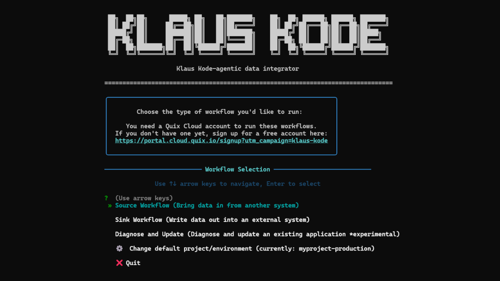

# Klaus Kode Quick Start

If you just want to get going ASAP, here are the major steps:

1. **Install the Claude Code CLI**: if you don't have it already  
   * **Windows** users, you must install Claude using this command:  
     `irm https://claude.ai/install.ps1 | iex`  
     (_This is due to limitations with `claude.cmd`—if you previously installed it using `npm`, please uninstall and reinstall using `install.ps1`._)

   * **Linux/Mac** users can run a similar command:  
     `curl -fsSL https://claude.ai/install.sh | bash` 

2. **Clone this repo** and navigate into the repo folder in a terminal window.

   ```bash
   git clone https://github.com/quixio/klaus-kode-agentic-integrator.git
   cd klaus-kode-agentic-integrator
   ``` 

3. **Create a `.env` file**: by copying the `.env.example` and adding your Quix PAT token and Anthropic API key.

4. **Run the startup script**: `bash start.sh` (Linux/Mac) or `start.bat` (Windows)

5. **Follow the on-screen prompts**.



For a more detailed explanation of what Klaus Kode is for and how to get started, see the next section: 

---

# Getting Started with Klaus Kode — the Agentic Data Integrator

Klaus Kode is a Python-based Agentic Data Integrator that helps you [vibe code](https://en.wikipedia.org/wiki/Vibe_coding) your data integrations so you can connect to more systems, faster. You run it in your terminal as a workflow wizard. It uses AI agents to generate connector code, run and test that code, analyze logs, as well as manage dependencies and environment variables. It uses the [Quix Cloud](https://quix.io/quix-cloud) platform as a sandbox for running code in isolated containers and storing data. 

Note that Klaus Kode is designed to help build pipelines that need *high throughput*. If you’re dealing with a very small number of events (such as emails and chat messages from a handful of users), you might be better off with [make.com](http://make.com) or [n8n.io](https://n8n.io/). 

Klaus Kode is best suited for scenarios where you need to integrate high-fidelity data sources — this could be continuous telemetry streams, blockchain transaction feeds, or large static datasets that need to be ingested and processed in a distributed manner.

## **Prerequisites**

You’ll need a few things already in place before you can start with Klaus Kode. 

**These include**:

1. Python (3.12 or later) and Git installed on your system  
2. The Claude Code CLI  
3. A Quix project and PAT token  
4. An Anthropic API token and billing enabled for the Anthropic APIs.  
   *\* If you are a Quix customer and early beta tester, you might be able to get these keys from the Quix team*

Klaus Kode has been tested on Ubuntu (via Windows WSL) and Mac OS. It should work on Windows too but has not been extensively tested on Windows.

### **Notes on Installing the Claude Code CLI**

Klaus Kode leverages the Claude Code SDK under the hood, which in turn uses the Claude Code CLI. If you don't have an Anthropic account yet, [sign up](https://claude.ai/login) first.

According to [Anthropic's official instructions](https://docs.anthropic.com/en/docs/claude-code/setup), you install Claude Code like this:

```shell
npm install -g @anthropic-ai/claude-code
```

However, if you are using **Windows**, you must install it using the install script. Existing `npm`-based installations will not work.

Here's how to run the install scripts for all operating systems:

```shell
(Linux/Mac)            curl -fsSL https://claude.ai/install.sh | bash

(Windows PowerShell)   irm https://claude.ai/install.ps1 | iex
```

### **Tokens and API Keys**

Klaus Kode uses the Anthropic Sonnet API for log file analysis and Claude Code (also Sonnet) for code analysis and editing. Quix Cloud is used for deployments and sandbox testing. 

In summary, you need the following keys and tokens: 

1. An [Anthropic API key](https://docs.anthropic.com/en/api/overview) — requires an Anthropic account with billing enabled and enough credit to run Claude Code.  
2. A [Quix Cloud PAT token](https://quix.io/docs/develop/authentication/personal-access-token.html) — you can [sign up for free](https://portal.cloud.quix.io/signup?utm_campaign=klaus-kode) to get one. (This lets Klaus Kode run the code in a cloud sandbox.)

Then configure your environment variables with these keys, as described in the following section.

---

## **Klaus Kode Setup**

To use Klaus Kode, clone the repo, add your environment variables, and run the startup script.

Here are those steps again in more detail:

1) Clone the Klaus Kode repo   

```shell
git clone https://github.com/quixio/klaus-kode-agentic-integrator
```
  
2) Create a `.env` file (make a copy of the `.env.example`) and enter your API keys and PAT token:  

```env
ANTHROPIC_API_KEY=<your-anthropic-api-key> # "sk-ant-api..." - required for all AI operations
QUIX_TOKEN=<your-quix-token>                # "pat-..." 
QUIX_BASE_URL=https://portal-api.cloud.quix.io/

## OPTIONAL: If Klaus cannot automatically detect your Claude Code installation
CLAUDE_CLI_PATH=/home/username/.claude/local/node_modules/.bin
```

3) Run the startup script, which creates a virtual environment, activates it, and installs the dependencies from `requirements.txt` (assuming Linux/Mac):

**Linux/Mac**
```shell
bash start.sh
```

**Windows**
```shell
./start.bat
OR
./start.ps1
```

---

## Klaus Kode Data Integration Workflow

You don't have to understand the workflow to get started—you can just give it a go and see what happens.

However, if you're used to using a free-form chat interface to generate code, it can be helpful to understand what awaits you.

Klaus Kode is different from most AI-based clients because it uses a cloud environment (Quix Cloud) to manage code rather than a local project. This cloud environment requires you to follow specific workflows.

When you start Klaus Kode, you’ll see the following options:

```
Select Workflow Type
--------------------
  ▶ 1. Source Workflow (Bring data in from another system)
    2. Sink Workflow (Write data out into an external system)
    3. Transform Workflow (Process data in flight) *Coming soon
    4. Debug Workflow (Diagnose and fix existing sandbox code) *Coming soon
```

Hopefully, the wording is straightforward enough to help you choose the right option.

Here's an overview of the steps in each workflow:

**SOURCE WORKFLOW**  


**SINK WORKFLOW**  


For more details on the full workflows, check out this [Example Workflow Walkthrough](docs/example_workflow.md). It shows you how to read from the Wikipedia "Change Event Stream" and sink the incoming page edit metadata into a Clickhouse Database (with a Kafka topic in the middle).
