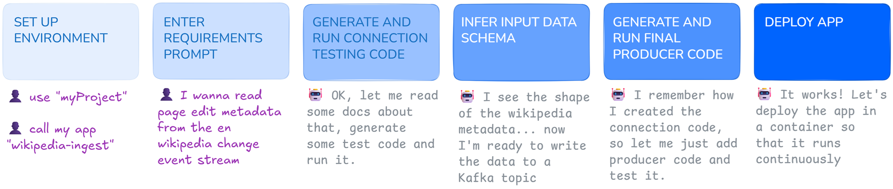

# End-to-end Tutorial: Subscribe to the Wikipedia Change Event Stream and Sink Metadata to Clickhouse

To understand the Klaus Kode workflows better, let's look at an example scenario and break down how you would implement it in Klaus Kode.

Suppose that you want to do some kind of research on Wikipedia page edits that happen in the coming week. In technical terms, you want to listen to the Wikipedia Change Event Stream and sink the data to a Clickhouse database so that you can query it offline.

Here’s an outline of how it would work in Klaus Kode:

* First, you start Klaus Kode and choose the **Source Workflow** option (since we’re sourcing data from an external data stream).  

  * Klaus Kode will help you create a sandbox app and guide you through the process of creating Python code to get data from the Wikipedia Change Event Stream. This data is written to a “topic” (essentially a giant log file—a place to put the data we get from Wikipedia).

* Once that’s done, you return to the wizard and choose the **Sink Workflow**.

  * Klaus Kode will help you create another sandbox app and guide you through creating Python code that reads from the topic you created in the source workflow and sinks that data into a Clickhouse database (with proper backpressure, batching, and other functionality).

This is a very simple example scenario. We’re purposely not doing much to the data while it’s in flight (such as aggregating or analyzing it). The goal is to show how you can use AI to get high volumes of data in and out of any system.

---

## The Source Workflow

When following the source workflow, you’ll be guided through these phases:



The illustration above abstracts a few steps. Here's the full list for transparency:

**1—ENVIRONMENT SETUP**  
**2—REQUIREMENTS GATHERING**  
**3—CODE GENERATION**  
**4—CONNECTION CODE TESTING**  
_(If connection code fails)_ **5—FIRST DEBUG PHASE**  
**6—SCHEMA ANALYSIS**  
**7—PRODUCER CODE CREATION**  
**8—PRODUCER CODE TESTING**  
_(If producer code fails)_ **9—FINAL DEBUG PHASE**  
**10—DEPLOYMENT**

---

### 1—Environment Setup Phase

Klaus Kode will ask for details specific to the Quix Cloud environment (it detects these based on your PAT token).

Quix Cloud is where code runs and data is stored.

* Choose an **app name**: e.g., `wikipedia-source`  
* Select a **Project**: Choose the default “MyProject” 
* Select a **Topic**: Choose the default “input-data” (a topic is a log file for storing incoming Wikipedia data)

---

### 2—Requirements Gathering Phase

Klaus Kode will ask what you want to do: the source system, and what kind of data to collect. The goal is to generate code that connects to the source and retrieves sample data for schema analysis. Nothing is written to a Kafka topic yet.

* Example Requirement: “I want to read basic page edit metadata from the Wikipedia Change Event Stream.”

---

### 3—Code Generation Phase

Klaus Kode invokes the Claude Code CLI, which generates Python code that connects to the Wikipedia EventStreams HTTP Service.

> [!NOTE]  
> Klaus Kode has a “knowledge folder” where you can place documentation for systems you're integrating. Claude Code will search this folder before querying the web. For this tutorial, a markdown version of the Wikipedia event stream docs is included at:  
> `./resources/other/source_external_docs/Wikipedia Changes Event Stream HTTP Service - Wikitech.md`

* **Review Code**: When generation is complete, you can approve the code with `Y`.
* **Environment Variables**: Claude will use env vars, but doesn’t know the values. Klaus Kode will prompt you to fill them in.

---

### 4—Connection Code Testing Phase

Klaus Kode uploads the generated `app.py` to a sandbox in Quix Cloud, sets environment variables, installs dependencies, and runs the app.

It analyzes the logs to check for success. If successful, you’ll see sample output like:

```
[23:20:59] Raw event received: <class 'dict'> with keys: [...]
[23:20:59] Processing event #999997
  Title: File:Barbara Ronchi-66092.jpg
  User: Harald Krichel
  Wiki: commons.wikimedia.org
  Type: log
  Time: 2025-08-27T23:20:58Z
```

---

### 5—First Debug Phase (If Connection Fails)

If the code fails, you’ll be given options:

```
1. Let Claude Code SDK fix the error directly
2. Provide manual feedback
3. Retry with manual code fix
4. Continue anyway
5. Abort the workflow
6. ⬅️ Go back
7. 🚀 Auto-debug (retry with Claude up to 10 times)
```

> [!NOTE]  
> Be cautious with auto-debug. Claude can consume a lot of API tokens and may not detect basic connection issues like wrong passwords or hostnames.

---

### 6—Schema Analysis Phase

If the connection works, Klaus Kode performs schema analysis using Anthropic's Haiku API. A sample output:

```
**Fields and Data Types:**
- Title: String
- User: String
- Wiki: String
- Type: String
- Time: Datetime
- Comment: String
- Revision: JSON (old/new)
- Size Change: String
```

You can approve or modify the schema analysis.

---

### 7—Producer Code Creation Phase

This creates the main app that writes data to a Kafka topic.

* Additional Requirement: “Write all the metadata to a Kafka topic”

Claude Code uses the schema and connection logic to generate new code.

---

### 8—Producer Code Testing Phase

The app is uploaded, configured, and executed to verify it writes to the topic correctly.

Sample output:

```
✅ Event #999997 produced successfully!
{ 'value': { ... }, 'key': ..., 'timestamp': ..., 'headers': None }
```

> [!NOTE]  
> Be prepared for debug cycles—Claude may not succeed on the first try.

---

### 9—Main Debug Phase (If Producer Fails)

Same debug options as before.

---

### 10—Deployment Phase

If the app works, Klaus Kode offers to deploy it. The app runs in a Docker container on Quix Cloud (backed by Kubernetes).

You can monitor deployments via the Quix UI.

---

## The Sink Workflow

The sink workflow is similar to the source workflow, but doesn't require connection code. When following the sink workflow, you’ll be guided through these phases:


Let’s continue by writing the Wikipedia event data to a Clickhouse database.

If you don’t have a Clickhouse DB, you can use `deploy_clickhouse.py` or provision one using [Railway](https://railway.com/deploy/clickhouse).

---

### 1—Environment Setup Phase

Quix Cloud settings:

* Project: “MyProject” 
* Topic: “input-data”

---

### 2—Schema Analysis Phase

Klaus Kode reads sample data from the topic and analyzes the schema.

Sample structure:

```
"topicName": "wikipedia-data",
"streamId": "Category:All articles with style issues",
"type": "System.Byte[]",
"value": "{\"title\":\"...\",\"user\":\"...\",...}"
```

---

### 3—Sink Code Creation Phase

You describe what the sink should do.

* Example: “Write all the page edit metadata into Clickhouse using clickhouse-connect”

> [!NOTE]  
> You can suggest the Python library. Claude may default to an alternative that might not work as well.

---

### 4—Sink Code Testing Phase

Klaus Kode runs the app and checks logs for successful inserts.

Sample log output:

```
Processed 48 valid rows
Inserting 48 rows into wikipedia_edits
✓ Successfully inserted 48 rows into wikipedia_edits
```

> [!NOTE]  
> Expect debug cycles as needed.

---

### 5—Sink Debug Phase

Same options and cautions as before.

---

### 6—Deployment Phase

Once the app writes data successfully, Klaus Kode deploys it.

Final pipeline view:


The source app feeds the sink app via a topic. If the sink lags behind, the topic acts as a buffer.

---

## Next Steps

Eventually, you'll want a transformation app between the source and sink (e.g., aggregating edits). This avoids storing unnecessary raw data and makes analytics more efficient.

Klaus Kode doesn’t yet support a transformation workflow—but it’s on the roadmap.

In the meantime, you can try the "Diagnose and Update" workflow to iterate on an existing app. 

---
